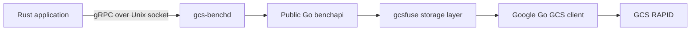

The practical answer is that a reusable benchmark API is very achievable because `NewEngine` and `Run` already exist; a general high-throughput GCS data-plane API is a much larger product. The strongest route is to first extract a small public Go facade, then expose it to Rust through a sidecar for benchmark control, adding in-process C ABI bindings only where measurements prove process boundaries inadequate.Yes, it is possible, but there are two very different projects hiding inside that idea:

1. Expose **the benchmark engine** to Rust.
2. Expose **Google’s high-performance Go GCS data path** as a general Rust storage API.

The first is moderate work. The second is substantial.

**What Already Helps**

`gcsfuse-bench` is better positioned than it might appear. Its benchmark path already bypasses FUSE and directly creates a storage handle, bucket, and engine in [cmd/benchmark.go](gcsfuse-bench/cmd/benchmark.go#L266). The core has a reasonably clean lifecycle:

```go
engine, err := benchmark.NewEngine(bucket, config, verbosity, output)
summary, err := engine.Run(ctx)
```

Those entry points already exist in [internal/benchmark/engine.go](gcsfuse-bench/internal/benchmark/engine.go#L148). The result is also a structured `RunSummary`, not merely console output, in [internal/benchmark/types.go](gcsfuse-bench/internal/benchmark/types.go).

The problem is packaging. The engine, storage interfaces, bucket types, instrumentation, and cache are under `internal/`, and command setup currently combines:

- Authentication
- Storage client creation
- RAPID detection
- DirectPath configuration
- Logging and metrics
- Preflight validation
- Benchmark execution
- Result export

I would first introduce a public Go package inside this repository, conceptually:

```go
package benchapi

type Client struct { ... }

func New(ctx context.Context, options ClientOptions) (*Client, error)
func (c *Client) Run(ctx context.Context, config BenchmarkConfig) (RunSummary, error)
func (c *Client) Close() error
```

That facade can legally use the existing internal packages while preventing them from leaking into the external contract.

**Ways Rust Can Call It**

Go supports building a `main` package as either:

- `go build -buildmode=c-shared`, producing a `.so` and C header.
- `go build -buildmode=c-archive`, producing a static archive and C header.

Rust can call the exported C functions through `extern "C"` declarations. Bindings could be handwritten because the intended API should remain very small.

A sensible C ABI would use opaque handles and serialized messages:

```c
uint64_t gcs_client_create(const uint8_t *config, size_t len, GcsError *err);
int32_t gcs_benchmark_run(
    uint64_t client,
    const uint8_t *request,
    size_t request_len,
    GcsBuffer *result,
    GcsError *err);
int32_t gcs_operation_cancel(uint64_t operation);
void gcs_buffer_free(GcsBuffer buffer);
void gcs_client_destroy(uint64_t client);
```

JSON is sufficient initially. Protobuf is better if the interface grows.

This does embed the Go runtime in the Rust process. You must carefully handle:

- Go panics at every exported boundary.
- Memory ownership and explicit buffer-free functions.
- Cancellation and concurrent calls.
- Go pointer/cgo lifetime restrictions.
- Rust shutdown while Go goroutines remain active.
- Shared-library discovery and packaging.
- Signals, logging, and environment variables.
- Toolchain and libc compatibility.

It also changes the current deployment model: `gcsfuse-bench` deliberately builds with `CGO_ENABLED=0`, while `c-shared`/`c-archive` requires cgo and a C toolchain.

**Recommended Architecture**

For benchmarking, I would initially avoid in-process FFI:



The Rust application would send workload configuration and receive progress and structured results. All object data generation and GCS traffic would remain inside Go, so the Unix socket carries only control messages and metrics. It would not limit the 20 GB/s data path.

Advantages over C ABI:

- Process crashes and Go panics are isolated.
- Clean cancellation and lifecycle semantics.
- Rust can use tonic normally for this control API.
- The Go binary remains independently testable.
- Version negotiation is straightforward.
- No cross-language allocator or pointer-lifetime hazards.
- Updating the Go implementation does not require relinking every Rust executable.

For an actual object-storage API where Rust needs every object’s bytes, IPC becomes less attractive. Sending 20 GB/s through a Unix socket adds copies and another bandwidth ceiling. That version would require either coarse synchronous FFI calls, shared memory/`memfd`, or file-descriptor transfer. That is where the project gets significantly harder.

**Rough Effort**

| Scope | Prototype | Production quality |
|---|---:|---:|
| Rust wrapper that launches the existing CLI | 1–3 days | About 1 week |
| Public Go `benchapi` package | 1–2 weeks | 2–4 weeks |
| Go sidecar plus Rust client | 1–2 weeks | 4–8 weeks |
| C ABI for complete benchmark runs | 2–4 weeks | 1–3 months |
| General high-throughput Rust object API backed by Go | 1–2 months | 3–6+ months |

The production estimates include cancellation, resource cleanup, error modeling, packaging, concurrency tests, performance tests, and API compatibility.

My recommendation is:

1. Extract `benchapi` from the existing command path.
2. Build a small `gcs-benchd` using a Unix-domain control API.
3. Create a Rust client crate around that protocol.
4. Keep bulk data generation and transfer in Go.
5. Add an in-process C ABI only for specific Rust data-plane operations that cannot tolerate IPC.

That would provide immediate reuse in Rust projects without turning the entire gcsfuse codebase into a foreign-function interface. It also gives you a clean migration point: when Google’s native Rust API reaches performance parity, the Rust client can replace the Go backend without changing the higher-level workload interface.

I would put the **Go implementation and protocol definition in `gcsfuse-bench`**, while keeping the **Rust integration in a separate Rust crate**.

A clean structure would be:

```text
gcsfuse-bench/
├── api/benchapi/          # Public Go facade over internal benchmark/storage code
├── api/proto/             # Language-neutral service definitions
├── cmd/gcs-benchd/        # Optional Unix-socket/gRPC sidecar
├── cmd/...                # Existing CLI
├── internal/benchmark/    # Existing implementation
└── internal/storage/      # Existing optimized GCS path
```

Then either create:

```text
gcs-bench-rs/
├── Cargo.toml
└── src/
    └── lib.rs             # Rust client and Rust-friendly types
```

or initially place it under:

```text
gcsfuse-bench/clients/rust/
```

I prefer a **separate Rust repository/crate once the protocol is stable**, especially if `s3dlio`, `dl-driver`, and other Rust projects will consume it. This prevents every Rust application from depending directly on a large Go source tree and makes versioning cleaner.

**Why ownership belongs in `gcsfuse-bench`:**

- The Go facade wraps code maintained there.
- The daemon must track changes to Google’s Go GCS client.
- RAPID detection, DirectPath, pooling, and benchmark semantics are owned there.
- Interface changes can be tested alongside the implementation.
- The protocol schema can serve as the compatibility contract.

**Why the Rust client should be separate:**

- It has its own Cargo dependency and release lifecycle.
- Multiple Rust projects can consume it normally.
- It isolates generated Rust bindings and tonic dependencies.
- The eventual native-Rust replacement can retain the same Rust-facing API.
- Rust projects do not need to know whether the backend is Go today or native Rust later.

I would **not** add the wrapper directly to `s3dlio` first. That would make `s3dlio` own a Go runtime/process dependency and couple its storage abstraction to one benchmark fork. Instead, prove the public API in `gcsfuse-bench`, publish a small Rust client crate, and then optionally add that crate as an `s3dlio` feature or backend.

So the division is:

- **`gcsfuse-bench`**: Go engine, public facade, daemon, protocol schema.
- **Rust client crate**: transport, Rust types, lifecycle, error mapping.
- **`s3dlio` and other projects**: optional consumers, only after the interface is proven.

This also fits your long-term goal: when Google’s Rust client reaches parity, the Rust crate can switch from the Go daemon to a native backend while preserving its public workload/session API.
